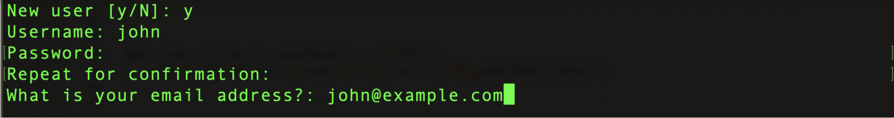
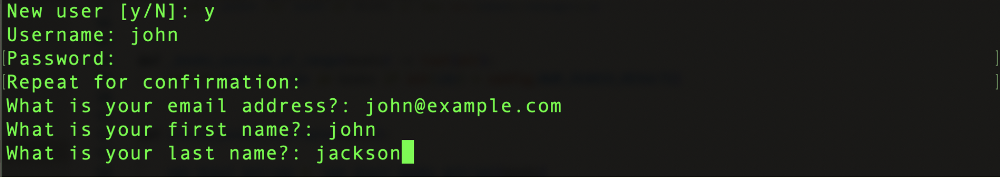
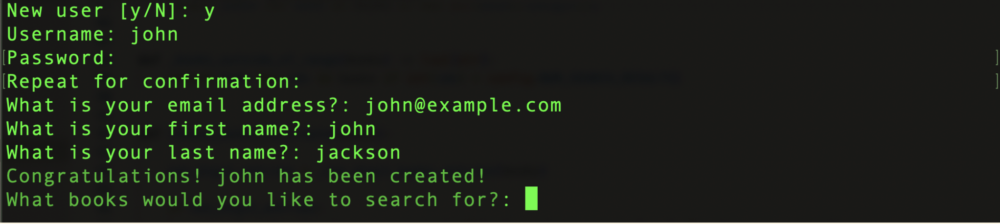
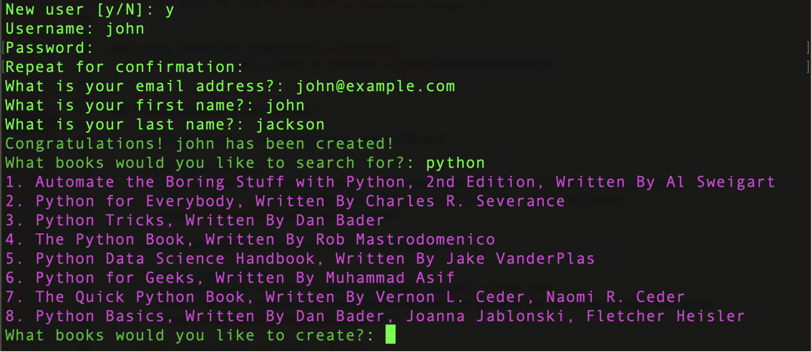
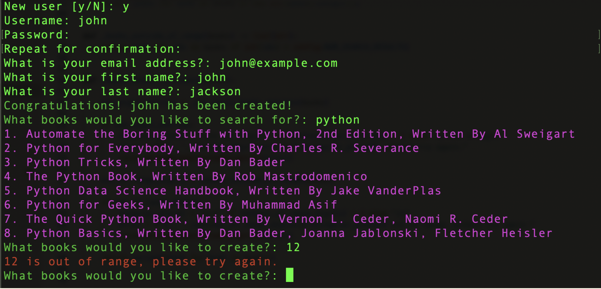
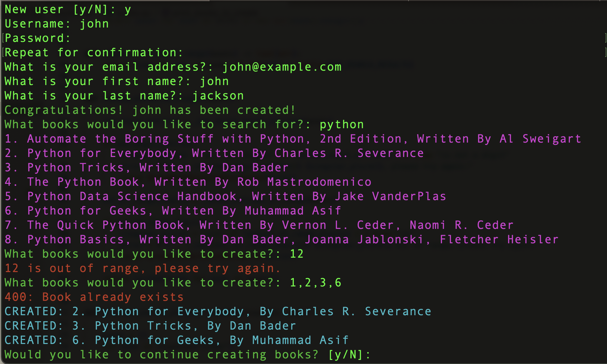
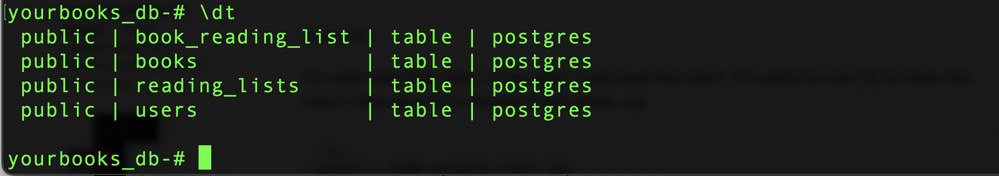
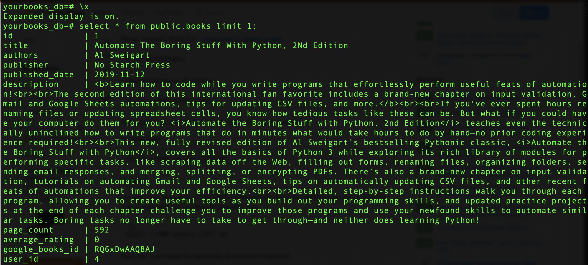

## General Info

Command Line Interface program built for a FastAPI application allowing individuals to manage their reading lists from an ever-growing books database. To learn more about the FastAPI application, please check it out [here](https://github.com/BenGriffith/book-api).

This CLI was built using Typer and leverages Google Books API. It currently serves the FastAPI application hosted [here](https://yourbooks.bengriffith.dev/docs). Using the CLI, you can:

- Create users
- Login as an existing user
- Query the Google Books API using different search terms
- Select books to be created in a Postgres database

Here are a few sample screenshots:



















## Setup

To run this project, follow the steps below:
```
$ git clone https://github.com/BenGriffith/book-api-cli.git
$ cd book-api-cli
$ python3 -m virtualenv venv
$ source venv/bin/activate
$ pip install -r requirements.txt
```

Make certain you are in the project root directory and then execute the following command:
```
$ python -m yourbooks
```